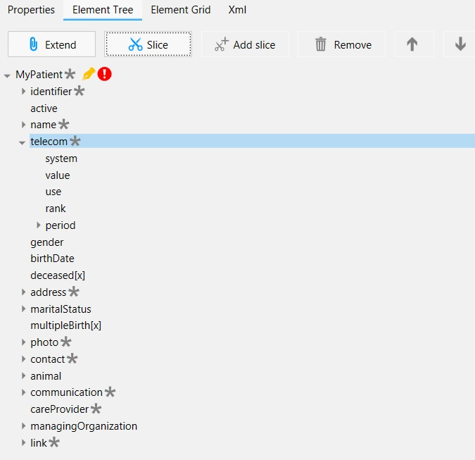
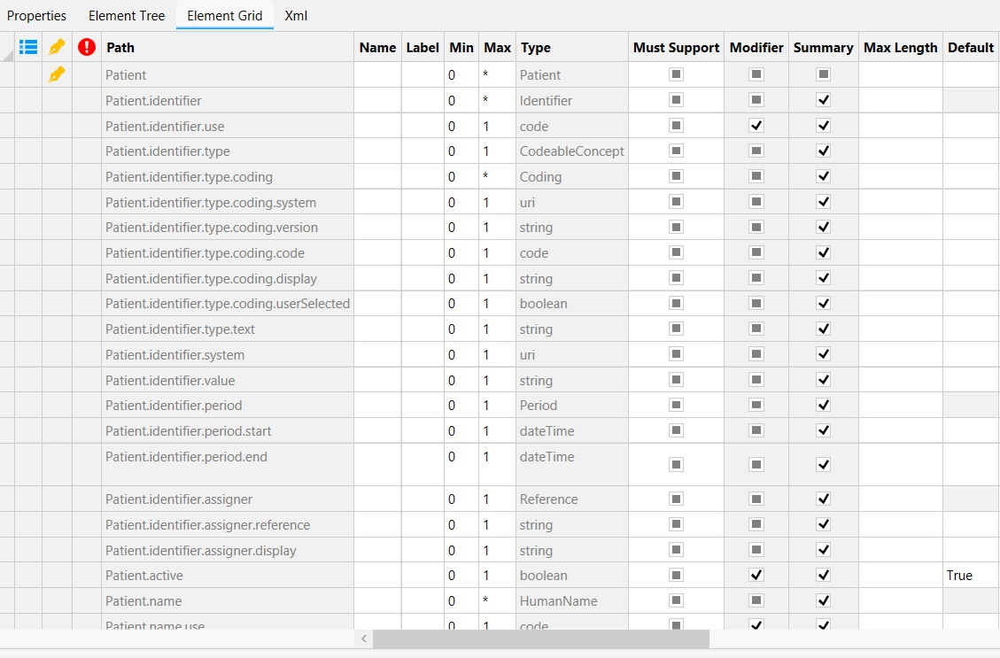

Features
========

Forge is the user-friendly editor for creating and editing profiles that enables modelers to create and manage profiles using a graphical user-interface.

With Forge you can:

* Create new Profiles
* Edit existing Profiles
* Define Constraints
* Define Extensions
* Define Slices
* Define Bindings

All these features will be described in more detail below.

Create new Profiles
-------------------
Forge enables you to create your own FHIR Profiles, based on one of the FHIR base resources.
To open a base resource and start editing, you can select *New Constraint* from the File menu. 
This will open a window in which you can select one of the base Resources or DataTypes.

If you selected the base Resource you need, you can start to create your own Profile based on this Resource. The different options you can use in editing your Profile will be explained in the following sections.

Edit existing Profiles
----------------------
In Forge you can edit the properties of a Profile as well as the elements of the Profile. 
Properties of the Profile are, for example, the profile URL, name, and publishing date. 

The elements of the Profile are the elements of the FHIR base Resource and extensions you can add yourself. 
In Forge you can view and edit these elements in the Element Tree, or in the Element Grid.

============= =============
|ElementTree| |ElementGrid|
============= =============
Element Tree   Element Grid
============= =============

Via the Element Tree you can edit Element Properties, slice Elements, or add extensions. 

Define Constraints
------------------
An important option for the editing of Element Properties is the option to add Constraints. 
In Forge you can add one or more constraints to an element for which you can specify the Constraint Key, Requirements, Severity, Description, and XPath expression. 

Define Extensions
-----------------
With Forge you can extend your Profiles or Elements with extensions created by yourself, or others. These extensions are elements which are not included in the FHIR base Resource.
In Forge you can select the Profile or Element which you want to extend and click the *Extend* button. This will add the *MyExtension* element into the Element Tree and will enable you to enter the URL of the extension you want to use in the Element Properties.

Define Slices
-------------
With Forge you can slice elements, allowing you to define multiple versions of the same element. 
For example, slicing an *identifier* element allows you to add and define multiple identifiers for one Profile. 
