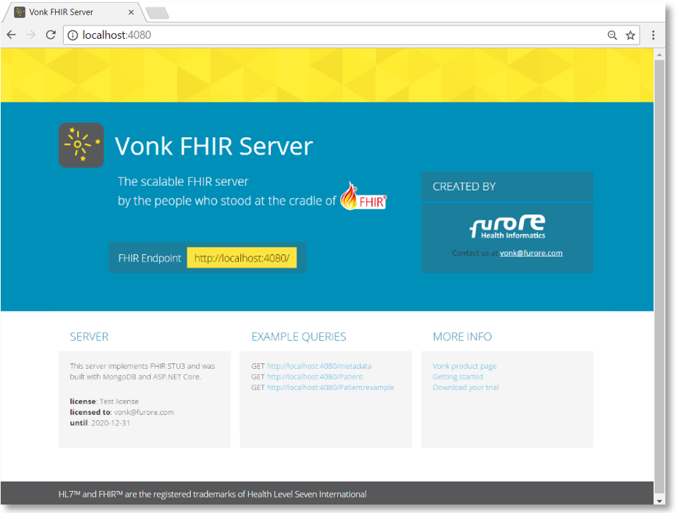

.. _use_docker:

====================
Using Vonk on Docker
====================

If you want to start using the standard Vonk server in your own Windows environment, follow these steps to install the server.
For non Windows systems, or if you want to use Docker for Windows, please look at the :ref:`use_docker` section.

1.	Download the Vonk binaries from Simplifier.net
	(link to binaries on Simplifier)
	
2.	Extract the downloaded files to a location on your system,
	for example: :code:`C:\Vonk`

3.	Open a command prompt or Powershell, navigate to your chosen location and run:
	:code:`.\Vonk.Server.exe`

	Vonk will then run on port 4080 of the system.
	
4.	If you want to check if Vonk is running correctly, open a browser and go to :code:`localhost:4080`.
	You should see a homepage similar to this:
   

The :ref:`next section <configure>` explains how you can configure the Vonk server.