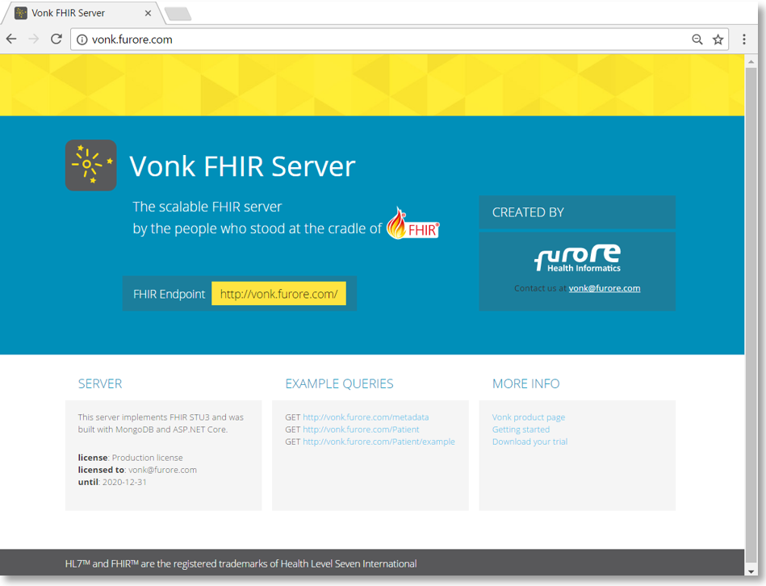

===============
Getting Started
===============

If you want to start using the standard Vonk server in your own environment, follow these steps to setup the server.

1. Download the Vonk binaries from Simplifier.net
	(link to binaries on Simplifier)
	
2. Extract the downloaded files to a location on your system.

3. Open a command prompt or Powershell and run:
	`.\Vonk.Server.exe`
	
	Vonk will then run on port 4080 of the system.
	
4. If you want to check if Vonk is running correctly, open a browser and go to `localhost:4080`.
   You should see a homepage similar to this:
   

